<p align="center">
  
</p>

---

### About Me
I spend most of my free time in IDA/Ghidra and WinDbg.
Doing projects out of boredom.

**Research**: Binary exploitation, kernel, anti-analysis 
**Primary**: C++ (17/20/23), x86-64 assembly, Windows/Linux internals

---

### Tech Stack
```text
Languages:    C++, C, Assembly (x86/x64), Python (tooling)
Domains:      Reverse Engineering, Binary Analysis, Vulnerability Research
Tools:        IDA Pro, Ghidra, WinDbg, x64dbg, Frida, CMake
```

---

### Connect
[](https://github.com/rupocom)
[](https://discord.com/users/1301658176671715330)

---

